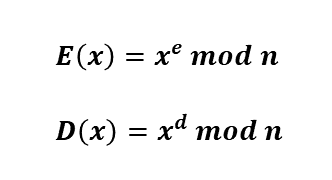

# Class ModuloP

# General info
The main subject of this project is group ***Zp***. This is an arithmetic on natural numbers modulo ***p***,
where ***p*** is a prime number. So, all calculations are done on the numbers *{0,1,2,...,p-1}*.  
Let's assume that ***p*** = 11 (it's easy to change in library.hpp -> const int modulo_integer).  
For example in ***Zp*** for ***p*** = 11:  
* 5+9 = 3
* 5-9 = 7
* 5*9 = 1
* 5/9 = 3  
and the last operator is defined: ***a/b = a * c***, where ***c*** is an inverse element. It means that ***a * c = 1 mod p***.
In our case ***9 * 5 = 45 = 1 mod 11* so *5/9 = 5 * 5 = 25 = 3mod(11)***

# Class Description
Class has two constructors - the default (initializing value object 0) and the constructor with
an argument of type int. Class has implemented following operators:
* binary: + *and* - *and* * *and* unary: -
* comparison: < *and* <= *and* > *and*d => *and* != *and* ==
* stream: << *and* >>

# RUN
1. cmake -> Makefile
2. make -> executable file

# Motivation
Finding the inverse element is useful in RSA protocol. General scheme of RSA:
* fix two diffrent number ***p,q*** -> ***n = p * q***
* ***m = phi(n) = (p-1)(q-1)*** where ***phi*** is the Euler totient function  
* find the number ***d*** such that ***gcd(d,m) = 1***
* find the number ***e*** such that ***d * e = 1 mod m***  
-> ***e*** is an invert element to ***d*** and main.cpp finds it
* next ***p,q,m*** should be forget and the PRIVATE KEY: ***(d,n)*** and PUBLIC KEY: ***(e,n)***
* encoding and decoding function:

  

